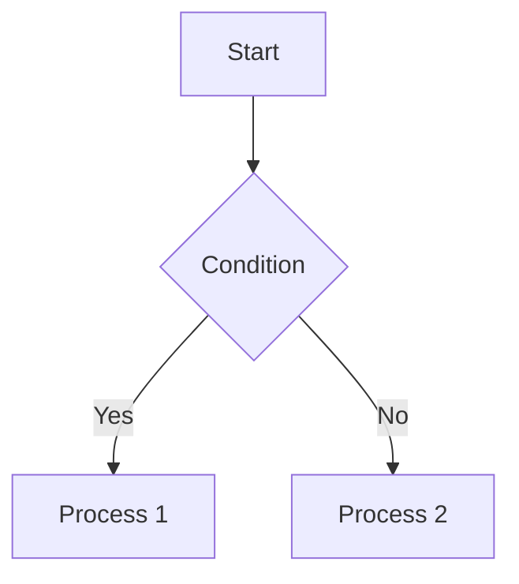
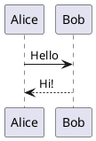

# Markdown Preview Enhanced

A powerful VSCode extension for Markdown preview with advanced Mermaid and PlantUML diagram support.

[日本語版はこちら / Japanese Version](README_ja.md)

## Features

### 📝 Markdown Preview
- **Real-time Updates**: Instant preview reflection of edits
- **Debounced Processing**: Configurable update delay for comfortable editing experience (default 300ms)
- **Side-by-Side Display**: Open preview alongside the editor
- **Syntax Highlighting**: Beautiful code block rendering

#### Supported Code Languages
- JavaScript (`javascript`, `js`)
- HTML (`html`, `htm`)
- CSS (`css`)
- PHP (`php`)
- Python (`python`, `py`)
- Ruby (`ruby`, `rb`)
- Java (`java`)
- YAML (`yaml`, `yml`)
- JSON (`json`)
- JSON Lines (`jsonl`)
- Diff (`diff`, `patch`)
- Bash (`bash`, `sh`, `shell`)
- SCSS (`scss`, `sass`)
- SQL (`sql`)

### 📊 Diagram Support

#### Mermaid
- Native rendering
- Isolated error display
- Supports multiple diagram types (flowcharts, sequence diagrams, class diagrams, etc.)

````markdown

````

#### PlantUML
- Supports both online and local modes
- **Online Mode**: Uses plantuml.com server (default, no setup required)
- **Local Mode**: Ultra-fast rendering with persistent PlantUML server (0.2-0.5s per diagram)

````markdown

````

### 📋 Copy to Clipboard Feature
- One-click copy for code blocks
- One-click copy for diagrams (Mermaid & PlantUML)
- Visual feedback on successful copy
- Hover to reveal copy button
- Supports all code languages and diagram types

### 🔍 Diagram Zoom Feature
- Click diagrams to open in modal view
- Zoom range: 10% - 1000%
- Pan/drag navigation
- Keyboard shortcuts:
  - `Ctrl/Cmd +`: Zoom in
  - `Ctrl/Cmd -`: Zoom out
  - `Ctrl/Cmd 0`: Reset zoom
  - `ESC`: Close modal

### 🎨 Themes
- **VS Code Light / Dark**: VS Code native themes

## Installation

### From Visual Studio Marketplace
1. Open VSCode
2. Open Extensions view (`Ctrl+Shift+X` / `Cmd+Shift+X`)
3. Search for "MD Previewer"
4. Click "Install"

### From VSIX File
```bash
code --install-extension markdown-preview-enhanced-0.1.0.vsix
```

## Usage

### Opening Preview

#### Method 1: Command Palette
1. Open a Markdown file
2. Open Command Palette (`Ctrl+Shift+P` / `Cmd+Shift+P`)
3. Select "Markdown Previewer: Open Preview"

#### Method 2: Editor Title Bar
With a Markdown file open, click the "Open Preview" icon in the editor title bar

### Zooming Diagrams
1. Click on a Mermaid or PlantUML diagram in the preview
2. Modal window opens
3. Zoom in/out using zoom controls or keyboard shortcuts
4. Pan using drag & drop

## Configuration

Customize via VSCode settings (`File > Preferences > Settings`), search for "Markdown Previewer".

### Main Settings

#### Debounce Delay
Debounce time for preview updates (milliseconds)

```json
"markdownPreviewer.preview.debounceDelay": 300
```

#### Default Zoom Level
Default zoom level for preview (percentage)

```json
"markdownPreviewer.preview.defaultZoom": 100
```

#### Theme
Preview panel theme

```json
"markdownPreviewer.preview.theme": "vscode-light"
```

Options: `vscode-light`, `vscode-dark`

#### Auto Preview
Automatically open preview when opening Markdown files

```json
"markdownPreviewer.preview.autoOpen": false
```

#### PlantUML Mode
PlantUML rendering mode

```json
"markdownPreviewer.plantuml.mode": "online"
```

Options: `online`, `local`

#### PlantUML JAR Path (for local mode)
Absolute path to PlantUML JAR file

```json
"markdownPreviewer.plantuml.jarPath": "/path/to/plantuml.jar"
```

#### PlantUML Server (for online mode)
PlantUML server URL

```json
"markdownPreviewer.plantuml.server": "https://www.plantuml.com/plantuml/svg/"
```

#### PlantUML Server Port (for local mode)
Port for local PlantUML server (0 = auto-detect available port in 18000-18100 range)

```json
"markdownPreviewer.plantuml.serverPort": 0
```

### PlantUML Local Mode Setup

To use local mode with persistent server (95% faster than online mode):

1. **Install Java**
   - Requires Java 8+
   - Verify with `java -version`

2. **Download PlantUML JAR**
   - Download from https://plantuml.com/download
   - Save to appropriate location (e.g., `/Users/username/plantuml.jar`)

3. **VSCode Configuration**
   ```json
   {
     "markdownPreviewer.plantuml.mode": "local",
     "markdownPreviewer.plantuml.jarPath": "/Users/username/plantuml.jar",
     "markdownPreviewer.plantuml.serverPort": 0
   }
   ```

#### How Local Mode Works

The extension starts a **persistent PlantUML server** when activated:
- **Single Java process**: Runs continuously in background (no startup overhead)
- **HTTP server mode**: PlantUML's `-picoweb` mode serves diagrams via HTTP
- **Automatic port detection**: Finds available port in 18000-18100 range (configurable)
- **Performance**: 0.2-0.5 seconds per render (vs 10 seconds with per-request spawning)
- **Lifecycle**: Server starts on extension activation, stops on deactivation
- **Resource efficient**: One Java process serves all rendering requests

## Supported Markdown Features

### Basic Syntax
- Headings (h1-h6)
- Emphasis (bold, italic)
- Lists (ordered, unordered)
- Links
- Images
- Code blocks (with syntax highlighting)
- Inline code
- Blockquotes
- Tables
- Horizontal rules

### Diagrams
- **Mermaid**: Flowcharts, sequence diagrams, class diagrams, state diagrams, etc.
- **PlantUML**: Sequence diagrams, use case diagrams, class diagrams, activity diagrams, etc.

## Requirements

- Visual Studio Code 1.85.0 or later
- For PlantUML local mode: Java 8+ and PlantUML.jar

## Known Limitations

- PlantUML local mode requires Java installation
- Very large files (10,000+ lines) may impact performance

## Troubleshooting

### Preview Not Updating
- Verify file is saved (or enable auto-save)
- Check if `debounceDelay` setting is too high
- Restart VSCode if issue persists

### PlantUML Local Mode Not Working
- Verify Java is installed: `java -version`
- Check JAR file path is correct in settings
- Verify JAR file is a valid PlantUML JAR
- Check if port is available (default 18000-18100 range)
- Look for server logs in VSCode Developer Tools Console (`Help > Toggle Developer Tools`)
- Try specifying a custom port in `markdownPreviewer.plantuml.serverPort` setting

## Release Notes

### 0.3.0 - Performance Improvement
- **PlantUML Local Mode: 95% Performance Improvement** (10s → 0.2-0.5s)
- Persistent PlantUML server with automatic port detection
- Enhanced error diagnostics with detailed logging
- New configuration setting: `markdownPreviewer.plantuml.serverPort`

See [CHANGELOG.md](CHANGELOG.md) for detailed release history.

### 0.1.0 - Initial Release
- Markdown preview functionality
- Mermaid diagram support
- PlantUML diagram support (online/local modes)
- Diagram zoom & pan functionality
- Modal diagram viewer
- Multiple theme support
- Copy to clipboard for code blocks and diagrams
- E2E test suite

## License

MIT License

Copyright (c) 2025 Masanao Ohba

Permission is hereby granted, free of charge, to any person obtaining a copy
of this software and associated documentation files (the "Software"), to deal
in the Software without restriction, including without limitation the rights
to use, copy, modify, merge, publish, distribute, sublicense, and/or sell
copies of the Software, and to permit persons to whom the Software is
furnished to do so, subject to the following conditions:

The above copyright notice and this permission notice shall be included in all
copies or substantial portions of the Software.

THE SOFTWARE IS PROVIDED "AS IS", WITHOUT WARRANTY OF ANY KIND, EXPRESS OR
IMPLIED, INCLUDING BUT NOT LIMITED TO THE WARRANTIES OF MERCHANTABILITY,
FITNESS FOR A PARTICULAR PURPOSE AND NONINFRINGEMENT. IN NO EVENT SHALL THE
AUTHORS OR COPYRIGHT HOLDERS BE LIABLE FOR ANY CLAIM, DAMAGES OR OTHER
LIABILITY, WHETHER IN AN ACTION OF CONTRACT, TORT OR OTHERWISE, ARISING FROM,
OUT OF OR IN CONNECTION WITH THE SOFTWARE OR THE USE OR OTHER DEALINGS IN THE
SOFTWARE.

## Support

If you encounter issues or have feature requests, please report them in the Issues section of the GitHub repository.

---

**Enjoy!**
