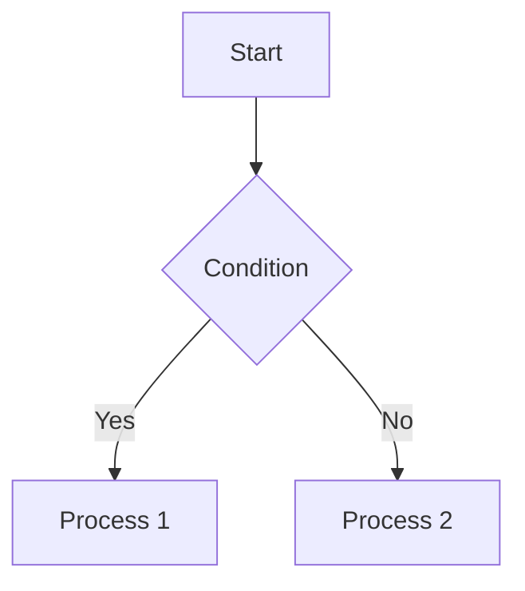
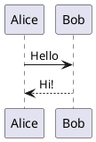

# MD Previewer - Mermaid & PlantUML

Advanced Markdown preview with native Mermaid and PlantUML diagram support for VSCode.

[日本語版はこちら / Japanese Version](README_ja.md)

## ✨ Key Features

| Feature | Description |
|---------|-------------|
| 📝 **Markdown Preview** | Real-time preview with syntax highlighting for 10+ languages |
| 📊 **Mermaid Diagrams** | Native rendering with error isolation |
| 🌐 **PlantUML Diagrams** | Online mode (default) & Local mode (95% faster) |
| 🔍 **Diagram Zoom** | 10%-1000% zoom with keyboard & mouse shortcuts |
| 📋 **Copy to Clipboard** | One-click copy for code blocks and diagrams |
| 🎨 **Themes** | VS Code Light/Dark themes |

## 🚀 Quick Start

### Installation
1. Open VSCode Extensions (`Ctrl+Shift+X` / `Cmd+Shift+X`)
2. Search for **"MD Previewer"**
3. Click **Install**

### Usage
1. Open any Markdown file
2. Click the preview icon in the editor title bar, or
3. Use Command Palette (`Ctrl+Shift+P` / `Cmd+Shift+P`) → **"Markdown Previewer: Open Preview"**

## 📊 Diagram Support

### Mermaid
````markdown

````

### PlantUML
````markdown

````

**Rendering Modes:**
- **Online Mode** (default): No setup required, uses plantuml.com
- **Local Mode**: 95% faster (0.2-0.5s vs 10s), requires Java + PlantUML.jar

## ⌨️ Keyboard & Mouse Shortcuts

### Diagram Zoom Shortcuts

| Action | Keyboard | Mouse |
|--------|----------|-------|
| Zoom In | `Ctrl/Cmd +` | `Ctrl/Cmd + Click` |
| Zoom Out | `Ctrl/Cmd -` | `Alt + Click` |
| Reset Zoom | `Ctrl/Cmd 0` | - |
| Close Modal | `ESC` | - |
| Pan/Drag | - | Drag on zoomed diagram |

*Mouse shortcuts zoom centered on cursor position with visual feedback*

## ⚙️ Configuration

### Essential Settings

| Setting | Default | Description |
|---------|---------|-------------|
| `preview.debounceDelay` | `300` | Update delay in milliseconds |
| `preview.theme` | `vscode-light` | Theme (`vscode-light`, `vscode-dark`) |
| `preview.autoOpen` | `false` | Auto-open preview for Markdown files |
| `plantuml.mode` | `online` | Rendering mode (`online`, `local`) |

### PlantUML Local Mode Setup (Optional)

For 95% faster rendering:

1. **Install Java 8+** → Verify: `java -version`
2. **Download PlantUML JAR** → https://plantuml.com/download
3. **Configure VSCode** → `File > Preferences > Settings`:
   ```json
   {
     "markdownPreviewer.plantuml.mode": "local",
     "markdownPreviewer.plantuml.jarPath": "/path/to/plantuml.jar"
   }
   ```

<details>
<summary>Advanced PlantUML Settings</summary>

| Setting | Default | Description |
|---------|---------|-------------|
| `plantuml.jarPath` | `""` | Absolute path to PlantUML JAR (required for local mode) |
| `plantuml.server` | `https://www.plantuml.com/plantuml/svg/` | Server URL for online mode |
| `plantuml.serverPort` | `0` | Local server port (0 = auto-detect 18000-18100) |

**How Local Mode Works:**
- Persistent PlantUML server runs in background (single Java process)
- HTTP server mode (`-picoweb`) eliminates startup overhead
- Auto-detects available port in 18000-18100 range
- 0.2-0.5s per render vs 10s with per-request spawning
</details>

## 🛠️ Troubleshooting

<details>
<summary>Preview Not Updating</summary>

- Verify file is saved (or enable auto-save)
- Check `debounceDelay` setting (default 300ms)
- Restart VSCode if issue persists
</details>

<details>
<summary>PlantUML Local Mode Issues</summary>

1. Check Java: `java -version` (requires Java 8+)
2. Verify JAR path in settings
3. Check available ports (18000-18100 range)
4. View logs: `Help > Toggle Developer Tools > Console`
5. Try custom port: `"markdownPreviewer.plantuml.serverPort": 18080`
</details>

## 📝 Supported Features

### Markdown Syntax
Headings • Bold/Italic • Lists • Links • Images • Code Blocks (10+ languages) • Inline Code • Blockquotes • Tables • Horizontal Rules

### Code Highlighting
JavaScript • HTML • CSS • PHP • Python • Ruby • Java • YAML • JSON • Diff • Bash • SCSS • SQL

### Diagrams
**Mermaid:** Flowcharts, Sequence, Class, State, ER, Gantt, etc.
**PlantUML:** Sequence, Use Case, Class, Activity, Component, etc.

## 📋 Requirements

- **VSCode:** 1.85.0 or later
- **PlantUML Local Mode:** Java 8+ and PlantUML.jar (optional)

## 📖 Release Notes

See [CHANGELOG.md](CHANGELOG.md) for detailed release history.

**Latest:** v0.3.1 - Enhanced zoom controls with mouse shortcuts
**Previous:** v0.3.0 - 95% performance improvement for PlantUML local mode

## 📄 License

MIT License - Copyright (c) 2025 Masanao Ohba

## 💬 Support

Found a bug or have a feature request? [Open an issue](https://github.com/masanao-ohba/md-previewer/issues)

---

**Enjoy!** ⭐ Star us on [GitHub](https://github.com/masanao-ohba/md-previewer) if you find this useful!
