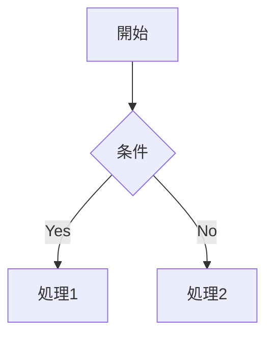
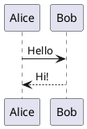

# MD Previewer - Mermaid & PlantUML

MermaidとPlantUMLダイアグラムの高度なサポートを備えた、VSCode Markdownプレビュー拡張機能です。

[English Version](README.md)

## ✨ 主な機能

| 機能 | 説明 |
|------|------|
| 📝 **Markdownプレビュー** | 10種類以上の言語のシンタックスハイライト付きリアルタイムプレビュー |
| 📊 **Mermaidダイアグラム** | ネイティブレンダリングとエラー分離表示 |
| 🌐 **PlantUMLダイアグラム** | オンラインモード(デフォルト) & ローカルモード(95%高速化) |
| 🔍 **ダイアグラムズーム** | 10%-1000%のズーム、キーボード & マウスショートカット対応 |
| 📋 **クリップボードコピー** | コードブロックとダイアグラムのワンクリックコピー |
| 🎨 **テーマ** | VS Code Light/Darkテーマ対応 |

## 🚀 クイックスタート

### インストール
1. VSCode拡張機能を開く (`Ctrl+Shift+X` / `Cmd+Shift+X`)
2. **"MD Previewer"** を検索
3. **インストール** をクリック

### 使い方
1. Markdownファイルを開く
2. エディタータイトルバーのプレビューアイコンをクリック、または
3. コマンドパレット (`Ctrl+Shift+P` / `Cmd+Shift+P`) → **"Markdown Previewer: Open Preview"** を実行

## 📊 ダイアグラムサポート

### Mermaid
````markdown

````

### PlantUML
````markdown

````

**レンダリングモード:**
- **オンラインモード** (デフォルト): セットアップ不要、plantuml.comを使用
- **ローカルモード**: 95%高速化 (0.2-0.5秒 vs 10秒)、Java + PlantUML.jarが必要

## ⌨️ キーボード & マウスショートカット

### ダイアグラムズームショートカット

| 操作 | キーボード | マウス |
|------|-----------|--------|
| ズームイン | `Ctrl/Cmd +` | `Ctrl/Cmd + Click` |
| ズームアウト | `Ctrl/Cmd -` | `Alt + Click` |
| ズームリセット | `Ctrl/Cmd 0` | - |
| モーダルを閉じる | `ESC` | - |
| パン/ドラッグ | - | ズームされたダイアグラムをドラッグ |

*マウスショートカットはカーソル位置を中心にズーム、視覚的フィードバック付き*

## ⚙️ 設定

### 基本設定

| 設定項目 | デフォルト | 説明 |
|---------|----------|------|
| `preview.debounceDelay` | `300` | 更新遅延時間(ミリ秒) |
| `preview.theme` | `vscode-light` | テーマ (`vscode-light`, `vscode-dark`) |
| `preview.autoOpen` | `false` | Markdownファイルを開いたときに自動プレビュー |
| `plantuml.mode` | `online` | レンダリングモード (`online`, `local`) |

### PlantUMLローカルモード設定 (オプション)

95%高速化を実現するには:

1. **Java 8+をインストール** → 確認: `java -version`
2. **PlantUML JARをダウンロード** → https://plantuml.com/download
3. **VSCodeを設定** → `ファイル > 環境設定 > 設定`:
   ```json
   {
     "markdownPreviewer.plantuml.mode": "local",
     "markdownPreviewer.plantuml.jarPath": "/path/to/plantuml.jar"
   }
   ```

<details>
<summary>PlantUML詳細設定</summary>

| 設定項目 | デフォルト | 説明 |
|---------|----------|------|
| `plantuml.jarPath` | `""` | PlantUML JARファイルの絶対パス (ローカルモードで必須) |
| `plantuml.server` | `https://www.plantuml.com/plantuml/svg/` | オンラインモード用サーバーURL |
| `plantuml.serverPort` | `0` | ローカルサーバーポート (0 = 自動検出 18000-18100) |

**ローカルモードの仕組み:**
- 永続的なPlantUMLサーバーがバックグラウンドで動作 (単一Javaプロセス)
- HTTPサーバーモード (`-picoweb`) により起動オーバーヘッドを削減
- 18000-18100の範囲で利用可能なポートを自動検出
- レンダリング時間: 0.2-0.5秒 vs リクエスト毎の起動では10秒
</details>

## 🛠️ トラブルシューティング

<details>
<summary>プレビューが更新されない</summary>

- ファイルが保存されているか確認 (または自動保存を有効化)
- `debounceDelay`設定を確認 (デフォルト300ms)
- 問題が続く場合はVSCodeを再起動
</details>

<details>
<summary>PlantUMLローカルモードが動作しない</summary>

1. Javaを確認: `java -version` (Java 8+が必要)
2. 設定でJARパスを確認
3. ポートが利用可能か確認 (18000-18100の範囲)
4. ログを確認: `ヘルプ > 開発者ツールの切り替え > コンソール`
5. カスタムポートを試す: `"markdownPreviewer.plantuml.serverPort": 18080`
</details>

## 📝 サポート機能

### Markdown構文
見出し • 太字/斜体 • リスト • リンク • 画像 • コードブロック(10種類以上の言語) • インラインコード • 引用 • テーブル • 水平線

### コードハイライト
JavaScript • HTML • CSS • PHP • Python • Ruby • Java • YAML • JSON • Diff • Bash • SCSS • SQL

### ダイアグラム
**Mermaid:** フローチャート、シーケンス図、クラス図、状態図、ER図、ガントチャートなど
**PlantUML:** シーケンス図、ユースケース図、クラス図、アクティビティ図、コンポーネント図など

## 📋 必要要件

- **VSCode:** 1.85.0以降
- **PlantUMLローカルモード:** Java 8+ および PlantUML.jar (オプション)

## 📖 リリースノート

詳細は [CHANGELOG.md](CHANGELOG.md) を参照してください。

**最新:** v0.3.1 - マウスショートカットによる拡張ズームコントロール
**前回:** v0.3.0 - PlantUMLローカルモードの95%パフォーマンス向上

## 📄 ライセンス

MIT License - Copyright (c) 2025 Masanao Ohba

## 💬 サポート

バグを発見した場合や機能リクエストがある場合は、[Issueを開く](https://github.com/masanao-ohba/md-previewer/issues)

---

**Enjoy!** ⭐ このプラグインが役に立ったら [GitHub](https://github.com/masanao-ohba/md-previewer) でスターをお願いします！
