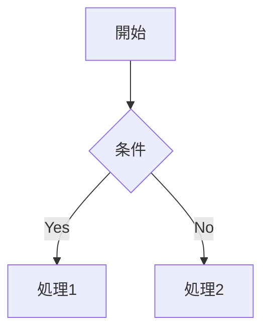
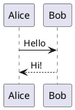

# Markdown Preview Enhanced

Mermaid & PlantUMLダイアグラムの高度なサポートを備えた、強力なVSCode Markdown プレビュー拡張機能です。

## 主な機能

### 📝 Markdownプレビュー
- **リアルタイム更新**: 編集内容が即座にプレビューに反映
- **デバウンス処理**: 快適な編集体験のための設定可能な更新遅延（デフォルト300ms）
- **サイドバイサイド表示**: エディタと並べてプレビューを開く
- **シンタックスハイライト**: コードブロックの美しい表示

### 📊 ダイアグラムサポート

#### Mermaid
- ネイティブレンダリング
- エラーの分離表示
- 複数のダイアグラムタイプをサポート（フローチャート、シーケンス図、クラス図など）

````markdown

````

#### PlantUML
- オンライン/ローカル両モード対応
- **オンラインモード**: plantuml.comサーバーを使用（デフォルト、セットアップ不要）
- **ローカルモード**: Java + PlantUML.jarで高速レンダリング

````markdown

````

### 🔍 ダイアグラムズーム機能
- ダイアグラムをクリックしてモーダル表示
- ズーム範囲: 10% - 1000%
- パン/ドラッグ操作でナビゲーション
- キーボードショートカット:
  - `Ctrl/Cmd +`: ズームイン
  - `Ctrl/Cmd -`: ズームアウト
  - `Ctrl/Cmd 0`: ズームリセット
  - `ESC`: モーダルを閉じる

### 🎨 テーマ
- **GitHub Light / Dark**: GitHubスタイルのテーマ
- **VS Code Light / Dark**: VS Codeネイティブテーマ
- **High Contrast**: アクセシビリティ対応の高コントラストテーマ

## インストール

### Visual Studio Marketplaceから
1. VSCodeを開く
2. 拡張機能ビュー（`Ctrl+Shift+X` / `Cmd+Shift+X`）を開く
3. "Markdown Preview Enhanced" を検索
4. 「インストール」をクリック

### VSIXファイルから
```bash
code --install-extension markdown-preview-enhanced-0.1.0.vsix
```

## 使い方

### プレビューを開く

#### 方法1: コマンドパレット
1. Markdownファイルを開く
2. `Ctrl+Shift+P` / `Cmd+Shift+P` でコマンドパレットを開く
3. "Markdown Preview Enhanced: Open Preview" を選択

#### 方法2: エディタータイトルバー
Markdownファイルを開いた状態で、エディタータイトルバーの「プレビューを開く」アイコンをクリック

### ダイアグラムのズーム
1. プレビュー内のMermaidまたはPlantUMLダイアグラムをクリック
2. モーダルウィンドウが開きます
3. ズームコントロールまたはキーボードショートカットで拡大/縮小
4. ドラッグ&ドロップでパン操作

## 設定

VSCodeの設定（`ファイル > 環境設定 > 設定`）から「Markdown Preview Enhanced」を検索してカスタマイズできます。

### 主な設定項目

#### デバウンス遅延
プレビュー更新のデバウンス時間（ミリ秒）

```json
"markdownPreviewEnhanced.preview.debounceDelay": 300
```

#### デフォルトズームレベル
プレビューのデフォルトズームレベル（パーセント）

```json
"markdownPreviewEnhanced.preview.defaultZoom": 100
```

#### テーマ
プレビューパネルのテーマ

```json
"markdownPreviewEnhanced.preview.theme": "github-light"
```

オプション: `github-light`, `github-dark`, `vscode-light`, `vscode-dark`, `high-contrast`

#### 自動プレビュー
Markdownファイルを開いたときに自動的にプレビューを開く

```json
"markdownPreviewEnhanced.preview.autoOpen": false
```

#### PlantUMLモード
PlantUMLレンダリングモード

```json
"markdownPreviewEnhanced.plantuml.mode": "online"
```

オプション: `online`, `local`

#### PlantUML JARパス（ローカルモード用）
PlantUML JARファイルの絶対パス

```json
"markdownPreviewEnhanced.plantuml.jarPath": "/path/to/plantuml.jar"
```

#### PlantUMLリクエスト方式（オンラインモード用）
PlantUMLサーバーへアクセスする際のHTTPメソッドを指定します。従来のURLベース描画には**GET**、URLが長くなる大きなダイアグラムにはソースをリクエストボディで送信する**POST**を使用します。

```json
"markdownPreviewEnhanced.plantuml.requestType": "get"
```

オプション: `get`, `post`

#### PlantUML自動ローカル切替閾値（自動モード）
自動モードでGETリクエストを使用する場合にローカル描画へ切り替える行数の閾値です。この値以上の行数を持つダイアグラムは、POSTモードが有効でない限りローカル描画に切り替わります。

```json
"markdownPreviewEnhanced.plantuml.localFallbackLineThreshold": 40
```

#### PlantUMLサーバー（オンラインモード用）
PlantUMLサーバーのURL

```json
"markdownPreviewEnhanced.plantuml.server": "https://www.plantuml.com/plantuml/svg/"
```

### PlantUMLローカルモードのセットアップ

ローカルモードを使用する場合（オプション）:

1. **Javaのインストール**
   - Java 8以上が必要
   - `java -version` で確認

2. **PlantUML JARのダウンロード**
   - https://plantuml.com/download からダウンロード
   - 適切な場所に保存（例：`/Users/username/plantuml.jar`）

3. **VSCode設定**
   ```json
   {
     "markdownPreviewEnhanced.plantuml.mode": "local",
     "markdownPreviewEnhanced.plantuml.jarPath": "/Users/username/plantuml.jar"
   }
   ```

## サポートされているMarkdown機能

### 基本構文
- 見出し（h1-h6）
- 強調（太字、斜体）
- リスト（順序付き、順序なし）
- リンク
- 画像
- コードブロック（シンタックスハイライト付き）
- インラインコード
- 引用
- テーブル
- 水平線

### ダイアグラム
- **Mermaid**: フローチャート、シーケンス図、クラス図、状態図など
- **PlantUML**: シーケンス図、ユースケース図、クラス図、アクティビティ図など

## 必要要件

- Visual Studio Code 1.85.0 以降
- PlantUMLローカルモードを使用する場合: Java 8+ および PlantUML.jar

## 手動確認

40 行以上の大きな PlantUML 図でも POST モードで描画できることを視覚的に確認したい場
合は、ブラウザで `tests/manual/plantuml-post-large.html` を開いてください。拡張機能が生成
するプレビューと同じマークアップで 80 行のシーケンス図を POST 経由で読み込み、ローダ
ーが Java ベースのローカル描画に戻ることなく SVG に置き換わる様子を確認できます。

## 既知の制限事項

- PlantUMLローカルモードはJavaインストールが必要
- 非常に大きなファイル（10,000行以上）ではパフォーマンスに影響がある場合があります

## トラブルシューティング

### プレビューが更新されない
- ファイルが保存されているか確認（または自動保存を有効化）
- `debounceDelay`設定が高すぎないか確認
- 問題が続く場合はVSCodeを再起動

### PlantUMLローカルモードが動作しない
- Javaがインストールされているか確認：`java -version`
- JARファイルパスが正しいか確認
- JARファイルが有効なPlantUML JARか確認

## リリースノート

### 0.1.0 - 初回リリース
- Markdownプレビュー機能
- Mermaidダイアグラムサポート
- PlantUMLダイアグラムサポート（オンライン/ローカルモード）
- ダイアグラムズーム & パン機能
- モーダルダイアグラムビューアー
- 複数テーマサポート
- E2Eテストスイート

## ライセンス

MIT License

Copyright (c) 2025 Masanao Ohba

Permission is hereby granted, free of charge, to any person obtaining a copy
of this software and associated documentation files (the "Software"), to deal
in the Software without restriction, including without limitation the rights
to use, copy, modify, merge, publish, distribute, sublicense, and/or sell
copies of the Software, and to permit persons to whom the Software is
furnished to do so, subject to the following conditions:

The above copyright notice and this permission notice shall be included in all
copies or substantial portions of the Software.

THE SOFTWARE IS PROVIDED "AS IS", WITHOUT WARRANTY OF ANY KIND, EXPRESS OR
IMPLIED, INCLUDING BUT NOT LIMITED TO THE WARRANTIES OF MERCHANTABILITY,
FITNESS FOR A PARTICULAR PURPOSE AND NONINFRINGEMENT. IN NO EVENT SHALL THE
AUTHORS OR COPYRIGHT HOLDERS BE LIABLE FOR ANY CLAIM, DAMAGES OR OTHER
LIABILITY, WHETHER IN AN ACTION OF CONTRACT, TORT OR OTHERWISE, ARISING FROM,
OUT OF OR IN CONNECTION WITH THE SOFTWARE OR THE USE OR OTHER DEALINGS IN THE
SOFTWARE.

## サポート

問題を発見した場合やフィーチャーリクエストがある場合は、GitHubリポジトリのIssuesセクションまでお知らせください。

---

**Enjoy!**
